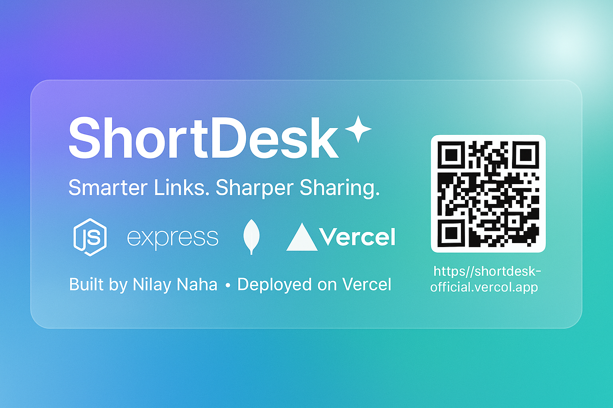

# 🌐 **ShortDesk** — Smart, Stylish URL Shortener

> ✨ A sleek, modern URL shortener that turns long, messy links into clean, beautiful, and trackable short URLs. Built with Node.js, Express, MongoDB, and EJS, and deployed on Vercel.

---

<p align="center">
  
</p>

<p align="center">
  <a href="https://nodejs.org"></a>
  <a href="https://expressjs.com"></a>
  <a href="https://www.mongodb.com/atlas"></a>
  <a href="https://vercel.com"></a>
  <a href="https://github.com/AmiNilay/shortdesk-official"></a>
</p>

---

## 🚀 **Live Demo**

🔗 **Visit Now:** [https://shortdesk-official.vercel.app](https://shortdesk-official.vercel.app)

---

## 🧠 **About**

**ShortDesk** is a modern, lightweight, and visually appealing URL shortener that transforms long URLs into short, memorable, and shareable links. It integrates **MongoDB Atlas** for secure data storage and is deployed serverlessly on **Vercel**.

ShortDesk is designed for personal use, project development, and developers seeking a balance of aesthetics and performance.

---

## ✨ **Features**

| 🧩 **Feature**        | 💡 **Description**                                                                 |
|----------------------|-----------------------------------------------------------------------------------|
| ⚙️ **Custom Alias**   | Create custom short URLs with personalized slugs (e.g., `/myproject`).             |
| 🔗 **Smart Validation** | Only accepts valid `http://` or `https://` URLs.                                  |
| 🧠 **Persistent Storage** | Stores all URLs securely in **MongoDB Atlas**.                                  |
| 🪩 **Glassmorphic UI** | Elegant, modern design with a glassmorphism effect for a sleek user experience.    |
| 📷 **QR Code Generator** | Generates a unique QR code for each shortened URL.                              |
| 🚀 **Serverless Ready** | Optimized for deployment on **Vercel**'s serverless Node runtime.                |
| 💾 **Secure ENV Handling** | Uses environment variables to manage sensitive data securely.                   |

---

## 🛠️ **Tech Stack**

**Frontend:**
- HTML5
- CSS3 (Glassmorphism design)
- EJS (Embedded JavaScript templates)

**Backend:**
- Node.js + Express
- Mongoose (MongoDB ODM)
- QRCode.js
- Nanoid (for unique short URLs)

**Deployment:**
- **MongoDB Atlas**
- **Vercel** (Serverless functions)
- **GitHub Integration**

---

## 📦 **Local Development Setup**

Follow these steps to run the project locally:

### 1️⃣ Clone the Repository

```bash
git clone https://github.com/AmiNilay/shortdesk-official.git
cd shortdesk-official
